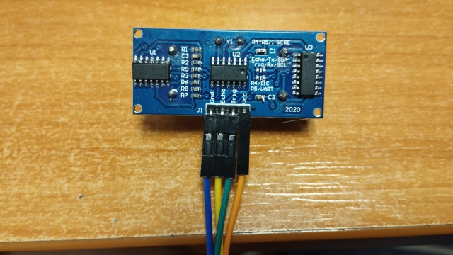

# Utrasonic water level meter
### assembling
parts:
- ESP32 C3 Super Mini
- TFT display 1.14" 135x240
- Ultrasonic sensor RCWL-1601

 

The sensor is located at a distance of 5 meters from the control board, I have not checked whether it is possible to increase the distance further. The sensor is installed in the lid of the water tank.
