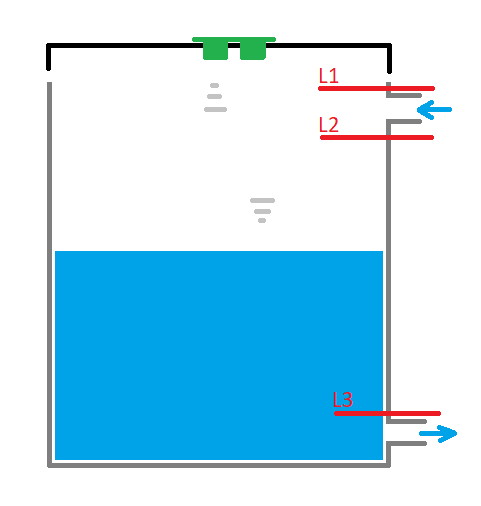
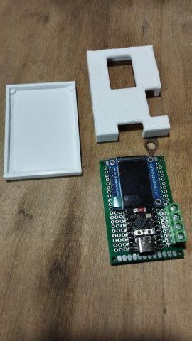
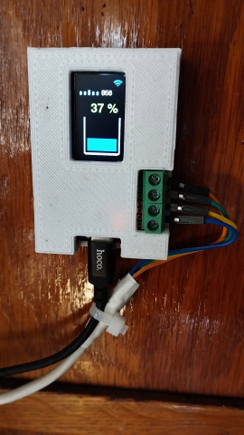

# Utrasonic water level meter
### Assembling
parts:
- ESP32 C3 Super Mini
- TFT display 1.14" 135x240
- Ultrasonic sensor RCWL-1601

The connection diagram is in the *water_meter.fzz* file (made in Fritzing), please note that I did not find the desired display model, the BLK contact is the CS contact on the real display, and the BLK contact is not actually connected

<p align="center"></p></br>
<p align="center"></p>

The sensor is located at a distance of 5 meters from the control board, I have not checked whether it is possible to increase the distance further. The sensor is installed in the lid of the water tank.

A project with source code and images for Arduino Studio in the *arduino_studio* folder, to connect to WiFi, you need to specify the correct ssid and pass. Next, you need to specify 3 level values (in mm) **from sensor** for correct calculation.

```
const char* ssid = "<SSID>";
const char* pass = "<password>";
const int levMin = 1150;
const int levMax = 340;
const int levMaxDiff = 80;
```

<p align="center"></p>

levMin -> L3 (minimum water level in the tank)\
levMax -> L2 (the level when we consider that the container is 100% full)\
levMaxDiff -> L2 -L1 (error correction range, somewhere in this range the tank stops filling)

If the water level approaches the sensor by less than L2-L1, it will be considered an emergency.

### The final view

The case for the final view of the control board is made in OrcaSlicer, an *water_meter_box.3mf* file

<p align="center"></p></br>
<p align="center"></p>

### Remote monitoring

The current level value in % can be obtained with an URL request:
```
http://<boart-ip>/
```
